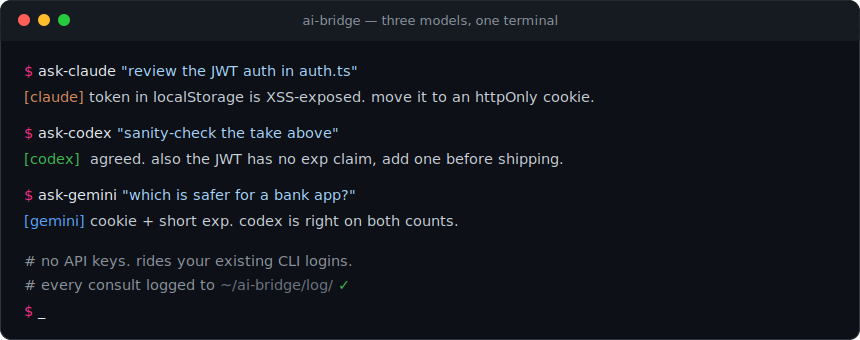

# ai-bridge

**Claude, Codex, and Gemini consulting each other from your terminal. No API keys, just the CLI logins you already pay for.**



Three tiny shell scripts. One verb per model, one shared log. Get a second (and third) opinion, or let one model review another's work, without leaving the terminal or wiring up a single API key.

## Why

You already pay for Claude, Codex, and Gemini. When they disagree, that disagreement is useful: it turns "which one is right?" into a panel instead of a guess. ai-bridge makes that a one-liner, and lets agents consult each other mid-task (Claude Code kicking off a Codex review with no human in the loop).

## The three verbs

| Command | What it runs |
|---|---|
| `ask-claude "..."` | Claude Code CLI in print mode |
| `ask-codex "..."` | Codex in a read-only sandbox (no repo writes) |
| `ask-gemini "..."` | Gemini CLI in print mode |

Every call is written to a timestamped markdown log in `~/ai-bridge/log/`, so the whole cross-model conversation stays searchable and auditable.

## Install

Install and authenticate the three CLIs first (Claude Code, Codex CLI, Gemini CLI), then:

```bash
git clone https://github.com/kalaniandrez/ai-bridge
cd ai-bridge
chmod +x bin/*
ln -s "$PWD"/bin/* /usr/local/bin/
```

## Use

```bash
# one model
ask-claude "explain this stack trace"

# hand one model's answer to another for review
ask-codex "sanity-check this: $(ask-claude 'summarize the risks in auth.ts')"

# break a tie
ask-gemini "which approach is safer for a bank app?"
```

## Design

Deliberately tiny. The value is the convention (one verb per model + a shared log), not the code. Security-conscious defaults: Codex runs sandboxed, no repo writes by default.

## License

MIT © Kalani André · Built in Puerto Rico · [kalani.place](https://kalani.place)
